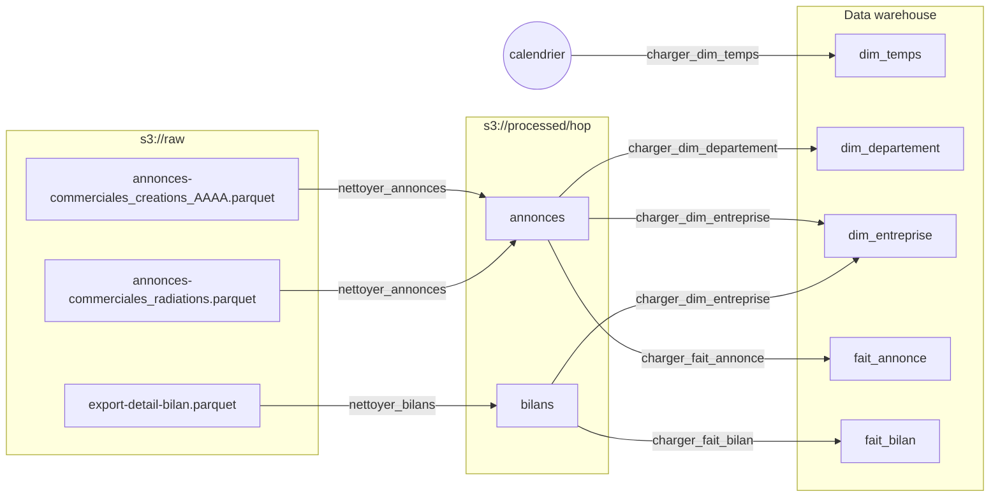
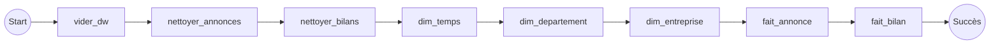
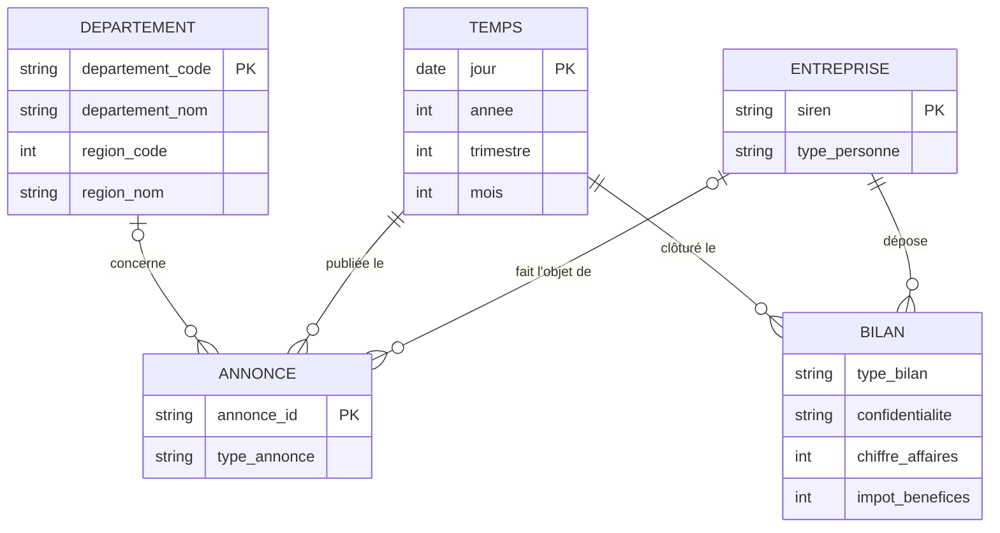
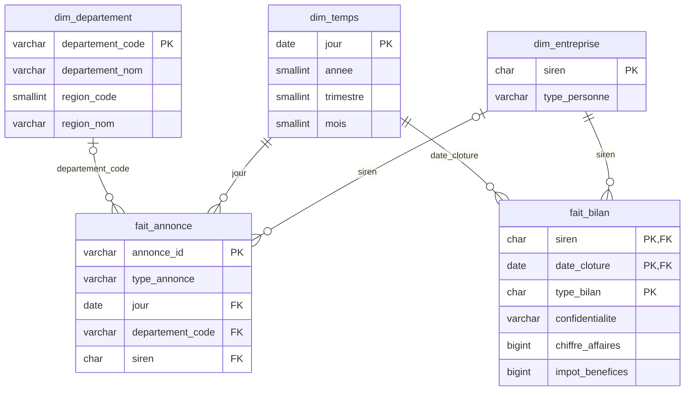

# Exercice 2 : traitements Apache Hop, du data lake au data warehouse

Objectif : transformer les fichiers bruts du data lake (bucket S3) en tables du data warehouse, sans écrire de
code, avec Apache Hop. Le projet Hop est dans [`hop/`](hop/). Il tourne dans l'environnement Docker de
l'[exercice 3](../exercice-3/).

## 1. Apache Hop en bref

Apache Hop est un ETL open source. Les traitements se dessinent : on pose des briques sur un canevas et on les
relie par des flèches.

| Notion | Rôle |
|---|---|
| **Pipeline** (`.hpl`) | Un traitement de données. Les lignes circulent d'une brique à l'autre, et toutes les briques travaillent en même temps, en flux. |
| **Transform** | Une brique de pipeline : lire un fichier, filtrer, extraire, dédoublonner, écrire dans une table… |
| **Hop** | La flèche entre deux briques, par laquelle passent les lignes. |
| **Workflow** (`.hwf`) | L'enchaînement des étapes : lancer un pipeline, exécuter du SQL, s'arrêter en cas d'échec. Les actions s'exécutent l'une après l'autre. |
| **Metadata** | Les objets partagés par tous les pipelines : connexions à la base, au bucket S3, configurations d'exécution. |
| **Projet** | Le dossier qui regroupe pipelines, workflows et metadata (ici `hop/`). |

On conçoit dans **Hop GUI** (ou **Hop Web**, la même interface dans un navigateur). On exécute dans l'interface,
ou en ligne de commande avec `hop-run`, ce que fait Airflow dans l'exercice 3.

### Ouvrir le projet

Avec l'exercice 3 lancé, ouvrir **Hop Web** sur http://localhost:8090. Le projet `dw` est déjà ouvert. Les
pipelines sont dans l'explorateur de fichiers, à gauche, et chacun s'exécute avec le bouton ▶.

Les connexions (dossier `hop/metadata/`) ne contiennent aucun mot de passe. Elles utilisent des variables
(`${S3_ACCESS_KEY_ID}`, `${DW_PASSWORD}`…), que Docker remplit depuis le fichier `.env`.

| Connexion | Type | Sert à |
|---|---|---|
| `garage` | MinIO (compatible S3) | Lire et écrire les fichiers du bucket : chemins `garage://bucket/fichier` |
| `duckdb` | Base DuckDB | Lire les fichiers Parquet du bucket (voir plus bas pourquoi) |
| `dw` | PostgreSQL | Écrire dans le data warehouse |

## 2. Le flux de traitement



### Données d'entrée

| Fichier dans `s3://raw` | Contenu | Lignes |
|---|---|---|
| `annonces-commerciales_creations_AAAA.parquet` | Annonces BODACC de création, une année par fichier (2008 à aujourd'hui) | 6,6 M |
| `annonces-commerciales_radiations.parquet` | Annonces BODACC de radiation | 4,3 M |
| `export-detail-bilan.parquet` | Bilans déposés ; liasse fiscale dans la colonne `liasse` (code → montant) | 6,4 M |

### Workflow `chargement_dw.hwf`

Il enchaîne tout le flux dans l'ordre, et s'arrête à la première erreur :



`vider_dw.hwf` vide les tables avant le rechargement, ce qui permet de relancer le flux sans créer de doublons.
Les dimensions sont chargées avant les faits, pour que les clés étrangères existent au moment de l'insertion.
Dans l'exercice 3, Airflow lance ces mêmes pipelines, mais chacun dans sa propre tâche, ce qui permet d'en
exécuter certains en parallèle.

### Les pipelines

Chaque pipeline porte une note qui explique ce qu'il fait. Les noms des briques ci-dessous sont ceux affichés
dans Hop.

**`nettoyer_annonces`** : créations et radiations → `processed/hop/annonces`

`Table input` DuckDB (tous les fichiers `annonces-commerciales_*.parquet` de `raw`) → `Filter rows`
(`typeavis = annonce`) → `Replace in string` (retire les espaces de `registre`) → `Regex evaluation` (SIREN) →
`Regex evaluation` (type de personne dans `listepersonnes`) → `Select values` (garde et renomme les colonnes) →
`Parquet File Output`

**`nettoyer_bilans`** : bilans → `processed/hop/bilans`

`Table input` DuckDB → `Filter rows` (clôture entre 2000 et 2030) → `Parquet File Output`

La colonne `liasse` est une *map* (code de la liasse → montant), un type que les briques Parquet de Hop ne savent
pas lire. La requête DuckDB en extrait les deux codes utiles : `liasse['FL']`, `liasse['HK']`.

**`charger_dim_temps`** : `Generate rows` (11 323 lignes) → `Add sequence` (numéro du jour) → `Calculator`
(1ᵉʳ janvier 2000 + n jours, année, trimestre, mois) → `Table output`

**`charger_dim_departement`** : `Table input` DuckDB (annonces nettoyées) → `Filter rows` (département
renseigné) → `Unique rows (HashSet)` sur le code → `Table output`

**`charger_dim_entreprise`** : `Table input` DuckDB (SIREN et type de personne des annonces), puis
`Table input` DuckDB (SIREN des bilans) + `Add constants` (type inconnu) → `Append streams` (annonces d'abord) →
`Unique rows (HashSet)` sur le SIREN → `Table output`

**`charger_fait_annonce`**, **`charger_fait_bilan`** : `Table input` DuckDB → `Table output`

### Pourquoi lire le Parquet avec DuckDB plutôt qu'avec « Parquet File Input »

Hop a une brique `Parquet File Input`, mais dans la version 2.19 elle mélange les lignes. Elle réutilise le même
tableau mémoire pour toutes les lignes d'un fichier, et quand les briques suivantes vont vite, une ligne est
écrasée avant d'avoir été traitée. Sur les radiations, un fichier relu par Hop ne contenait plus que 3,5 millions
d'identifiants distincts sur 4,27 millions, avec un résultat différent à chaque exécution. Le défaut est dans le
code de la brique (`ParquetInput.java`, appel à `RowDataUtil.addRowData`).

On lit donc chaque fichier avec un `Table input` sur la connexion DuckDB. La requête se limite à
`SELECT colonnes FROM read_parquet('s3://…')`, que Hop peut générer avec le bouton *Get SQL select statement*.
Tout le nettoyage reste fait par les briques Hop. DuckDB est aussi bien plus rapide : 41 secondes au lieu de
6 minutes pour lire les 4,3 millions de radiations. Les résultats ont été vérifiés ligne à ligne contre un
calcul de référence fait directement dans DuckDB, sans aucun écart.

L'écriture (`Parquet File Output`) n'a pas ce défaut.

### Règles de nettoyage

| Règle | Pourquoi |
|---|---|
| Seuls les avis initiaux (`typeavis = annonce`) | Les rectificatifs et annulations compteraient deux fois la même annonce. |
| SIREN = 9 premiers chiffres de `registre`, sans espaces | `registre` contient le numéro deux fois, avec et sans espaces, dans un ordre variable : `"843 380 197,843380197"`. |
| `type_personne` : `pm` (société) ou `pp` (personne physique) | Seules les sociétés paient l'impôt sur les sociétés : c'est le public d'une baisse d'IS. |
| Bilans : clôture entre 2000 et 2030 | Écarte les dates aberrantes (1919…). |
| Codes de la liasse : `FL` = chiffre d'affaires, `HK` = impôt sur les bénéfices | Ce sont les codes du régime normal. Les bilans simplifiés utilisent d'autres codes : leur chiffre d'affaires et leur impôt restent vides. |
| Un SIREN présent seulement dans les bilans a un type de personne inconnu | Le type vient des annonces. |

## 3. Modèle du data warehouse

Schéma en étoile : deux tables de faits, annonces et bilans, qui partagent les dimensions. Les raisons de ce
choix sont dans le [README de l'exercice 3](../exercice-3/README.md#forme-finale-des-données).

### MCD



Quelques annonces n'ont pas de SIREN exploitable, ou pas de département : d'où les cardinalités 0..1.

### MLD

Créé par [`exercice-3/sql/01_dw.sql`](../exercice-3/sql/01_dw.sql).



La vue `v_ratio_impot` ajoute à `fait_bilan` l'année de clôture et le ratio d'impôt (`HK / FL × 100`).

Exemple de requête pour l'exercice 1, créations et radiations de sociétés par année :

```sql
SELECT t.annee,
       count(*) FILTER (WHERE a.type_annonce = 'creation')  AS creations,
       count(*) FILTER (WHERE a.type_annonce = 'radiation') AS radiations
FROM fait_annonce a
JOIN dim_temps t USING (jour)
JOIN dim_entreprise e USING (siren)
WHERE e.type_personne = 'pm'
GROUP BY t.annee
ORDER BY t.annee;
```
