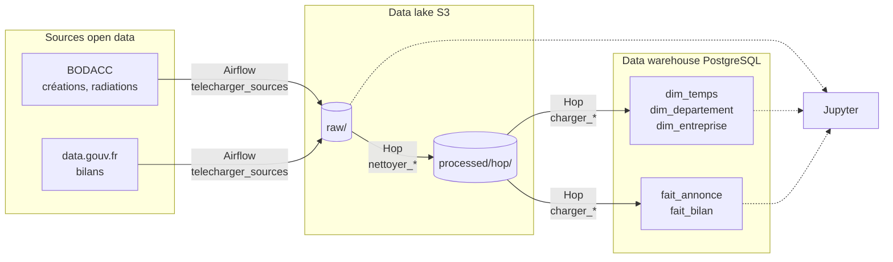
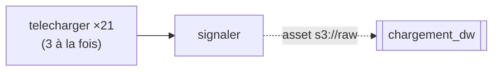
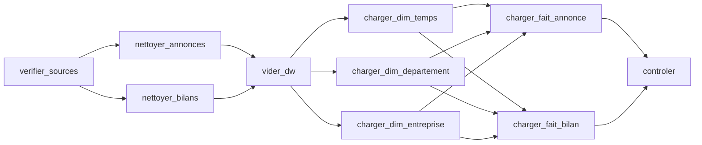

# Exercice 3 : data lake, Airflow, Hop et data warehouse en Docker

Un `docker compose up` monte toute la chaîne. Airflow télécharge les sources dans le data lake (bucket S3),
puis lance les pipelines Apache Hop de l'[exercice 2](../exercice-2/), qui les nettoient et les chargent
dans le data warehouse PostgreSQL. Jupyter sert à explorer les données.

## Lancer

Prérequis : Docker, environ 15 Go de disque et une connexion internet (les sources font 5 Go).

```bash
cd exercice-3
cp .env.example .env      # une seule fois, avant le premier démarrage
docker compose up -d --build
```

Il n'y a rien d'autre à faire. Au premier démarrage :

1. `garage-init` crée la clé S3 et les buckets `raw` et `processed`.
2. Le DAG `telecharger_sources` télécharge les sources dans `s3://raw` (5 Go, 15 à 30 minutes selon la
   connexion). Chaque fichier est vérifié : un export coupé en route est rejeté et retéléchargé.
3. Dès qu'il a fini, il déclenche le DAG `chargement_dw`, qui lance les pipelines Hop et remplit le data
   warehouse (environ 12 minutes).

Tout se suit dans Airflow : http://localhost:8080.

| Service | Rôle | Accès |
|---|---|---|
| `garage` | Data lake S3 ([Garage](https://garagehq.deuxfleurs.fr)) | API S3 `localhost:3900`, clés dans `.env` |
| `garage-webui` | Parcourir les buckets | http://localhost:3909 |
| `airflow` | Orchestration et visualisation des flux ; contient Hop pour exécuter les pipelines | http://localhost:8080 |
| `hop-web` | Apache Hop dans le navigateur : voir et modifier les pipelines sans code | http://localhost:8090 |
| `dw` | Data warehouse PostgreSQL | `localhost:5433`, base / utilisateur / mot de passe `dw` |
| `jupyter` | Prototypage Python (`notebooks/`) | http://localhost:8888, mot de passe `jupyter` |
| `postgres` | Base interne d'Airflow | |

Les ports n'écoutent que sur `127.0.0.1`. Les valeurs de `.env.example` sont publiques : changez-les dans `.env`
avant le premier démarrage si besoin (la clé S3 n'est importée qu'à l'initialisation de Garage).

`docker compose down` arrête tout en gardant les données. `docker compose down -v` efface aussi le data lake et
le data warehouse : tout sera retéléchargé au démarrage suivant.

### Choix techniques

- **Garage plutôt que MinIO** : les images MinIO ne sont plus publiées sur Docker Hub. Garage parle le même
  protocole S3, et Hop s'y connecte avec son connecteur MinIO.
- **Hop installé dans l'image Airflow** (`airflow/Dockerfile`) : chaque tâche du DAG lance un pipeline avec
  `hop-run` (script `airflow/hop-dw`). Les logs de Hop s'affichent dans la tâche Airflow, et une tâche en échec
  se relance seule.
- **Pilote DuckDB ajouté à Hop** : l'image Hop officielle ne l'inclut pas. Il ne fonctionne qu'avec glibc, alors
  que l'image Hop est basée sur Alpine (musl). On copie donc Hop dans l'image Airflow (Debian), et Hop Web, qui
  tourne sous Ubuntu, reçoit simplement le pilote.

## Les flux



| Zone | Contenu | Format |
|---|---|---|
| `s3://raw` | Fichiers tels que téléchargés : radiations, bilans, et une année de créations par fichier | Parquet |
| `s3://processed/hop` | Annonces et bilans nettoyés, aux colonnes du data warehouse | Parquet |
| data warehouse | Schéma en étoile, voir le [MLD](../exercice-2/README.md#3-modèle-du-data-warehouse) | PostgreSQL |

### DAG `telecharger_sources`

Quotidien. Il ne télécharge que les fichiers absents du bucket : supprimer un fichier de `s3://raw` le fait
retélécharger au passage suivant.



Les créations sont découpées par année : le site du BODACC coupe sans prévenir les exports de plus de 1,5 Go
environ. `signaler` met à jour l'asset `s3://raw` seulement si un fichier a été téléchargé, ce qui déclenche
`chargement_dw`. Les autres jours, il est sauté et le data warehouse n'est pas rechargé.

### DAG `chargement_dw`

Chaque tâche lance un pipeline Hop de l'exercice 2. Le graphe reprend l'ordre imposé par les clés étrangères :
nettoyage, puis dimensions, puis faits.



| Tâche | Ce qu'elle fait |
|---|---|
| `verifier_sources` | Échoue s'il manque une source dans `s3://raw`. |
| `nettoyer_annonces`, `nettoyer_bilans` | Pipelines Hop : `raw` → `processed/hop`. |
| `vider_dw` | Vide le data warehouse : le DAG peut être relancé sans créer de doublons. |
| `charger_*` | Pipelines Hop : `processed/hop` → tables du data warehouse. |
| `controler` | Échoue si une table est vide ; affiche les volumes et le nombre de créations et de radiations par année. |

Deux tâches au plus tournent en même temps : chaque pipeline lance une JVM de 3 Go.

Volumes après chargement (octobre 2026) :

| Table | Lignes |
|---|---|
| `fait_annonce` | 10,8 M (6,6 M créations, 4,2 M radiations) |
| `fait_bilan` | 6,4 M |
| `dim_entreprise` | 9,2 M |
| `dim_departement` | 101 |
| `dim_temps` | 11 323 |

## Forme finale des données

**Deux zones dans le data lake.** `raw/` garde les fichiers tels que téléchargés : on peut toujours tout
recalculer, et le notebook part de là. `processed/hop/` contient les données nettoyées, déjà aux colonnes du data
warehouse. Le chargement ne refait donc pas le nettoyage, et on peut relire ces fichiers sans passer par la base.

**Un schéma en étoile dans le data warehouse**, parce que toutes les questions de l'exercice 1 ont la même
forme : *combien* (de créations, de radiations, d'impôt payé) *par* année, département ou type d'entreprise.

- **Deux tables de faits**, parce qu'elles n'ont pas le même grain. Une annonce est un événement daté ; un bilan
  couvre un exercice comptable.
- **Trois dimensions partagées.** Le SIREN relie annonces et bilans (par exemple, l'impôt payé par les
  entreprises radiées). La date permet de comparer l'avant et l'après d'une réforme. Le département permet les
  comparaisons territoriales.
- **Seulement des mesures additives** (chiffre d'affaires, impôt). Le ratio d'impôt se calcule à la lecture,
  avec la vue `v_ratio_impot`, parce qu'additionner ou moyenner des ratios déjà calculés donnerait un faux résultat.
- **Pas de données personnelles** : les noms et adresses des annonces ne sont pas repris, ils ne servent à aucun
  indicateur.

Le MCD, le MLD et les règles de nettoyage sont détaillés dans le [README de l'exercice 2](../exercice-2/README.md).
Le schéma est créé au premier démarrage de PostgreSQL par [`sql/01_dw.sql`](sql/01_dw.sql).

## Organisation

```
docker-compose.yml
.env.example        variables (copier en .env)
garage/             configuration et initialisation du data lake
airflow/            image Airflow + Hop, script hop-dw, DAGs
hop-web/            image Hop Web avec le pilote DuckDB
sql/01_dw.sql       schéma du data warehouse
jupyter/            image Jupyter (DuckDB, boto3, s3fs)
notebooks/          notebook d'exploration (monté dans Jupyter sous work/)
```

Les pipelines Hop sont dans [`../exercice-2/hop/`](../exercice-2/hop/) : ils sont montés dans Airflow
(en lecture seule) et dans Hop Web. Une modification enregistrée dans Hop Web est donc prise en compte au
prochain lancement du DAG.
